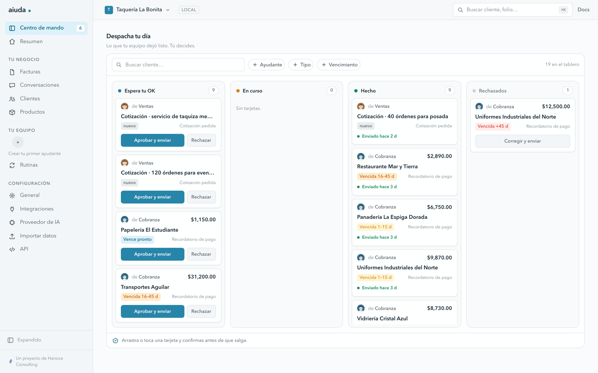
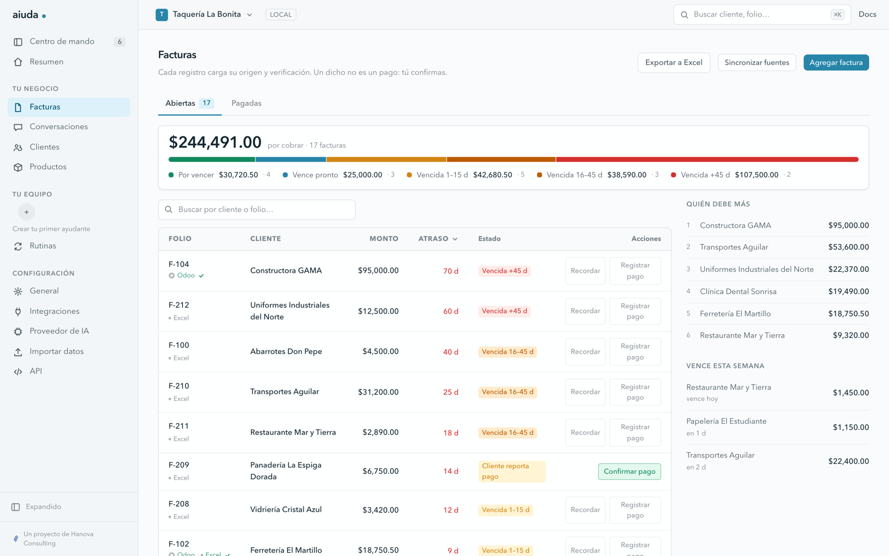

# aiuda

[](https://github.com/aiuda-io/aiuda/actions/workflows/ci.yml)
[](LICENSE)

Ayudantes de IA con humano en el loop para el back office de la PyME mexicana.
Corre en tu computadora. Todo el código es abierto.



## Qué es

aiuda le quita al dueño el trabajo administrativo repetido (cobranza,
conciliación, seguimiento) con **ayudantes**: agentes de IA que leen tus fuentes
(tu sistema, tus CFDIs, tu banco, tu WhatsApp, tu propia API), **proponen**
acciones y esperan a que **tú apruebes** antes de que salga nada.

En la práctica: conectas tu sistema o subes tu Excel, creas un ayudante con
nombre propio y su oficio, conectas tu IA, y cada mañana te espera la bandeja con
propuestas concretas, cada una con su factura, su fuente y su porqué. Apruebas,
editas o rechazas. Eso es todo el producto.

Principios:

- **Local-first.** Todo corre en tu máquina. Tus datos no viven en la nube de
  nadie.
- **Tu IA.** Si ya tienes Claude Code o Codex instalados, aiuda los usa con un
  clic: el programa se identifica con tu propia sesión y aiuda nunca ve tu token.
  Si no los tienes, traes tu llave o corres un modelo local con Ollama. aiuda no
  incluye ni revende inferencia.
- **Tus fuentes siguen mandando.** aiuda no es el sistema de registro: lee con
  procedencia y el write-back regresa a la fuente.
- **Honestidad.** Lo que no está probado en vivo lo dice la consola y lo dicen
  estos documentos.
- **Abierto.** Apache-2.0, sin features cerradas, sin edición de pago.

## Empezar

### Con la app de escritorio

Es una app normal: la abres y ella arranca el motor local, sin terminal. En el
primer arranque pregunta el nombre de tu negocio, revisa si ya tienes una IA en
la computadora y te ayuda a traer tus datos.

Todavía no hay un release publicado en GitHub. Hoy hay dos caminos:

**Pídela hecha.** Escribe a consulting@hanova.mx y te mandamos el instalador de
macOS (chip Apple). Todavía no está notarizado por Apple, así que la primera vez
tu sistema avisa que el desarrollador no está identificado y se abre con clic
derecho > Abrir. Solo esa vez, y sin escribir nada en ninguna terminal.

**Constrúyela tú.** Necesitas node, uv y Rust:

```sh
git clone https://github.com/aiuda-io/aiuda && cd aiuda
./scripts/build-app.sh      # ~7 minutos
```

Sale en `desktop/src-tauri/target/release/bundle/`. Tiene una ventaja concreta:
**la app que construyes en tu propia máquina no pasa por Gatekeeper.** El bit de
cuarentena lo pone el navegador al descargar, así que un `.dmg` hecho por ti abre
directo, sin avisos y sin clic derecho. Ese muro solo existe para quien lo baja
de internet.

Y el matiz honesto: construir desde el código es el camino de quien programa, no
el de la PyME. Un dueño de negocio en Veracruz no va a instalar Rust. Por eso la
notarización es el pendiente número uno: es lo que separa "cualquiera con una
terminal puede usarlo" de "cualquiera puede usarlo".

Qué está probado en cada plataforma, en [docs/INSTALAR.md](docs/INSTALAR.md).
Para verificar un instalador antes de repartirlo: `./scripts/prueba-app.sh`.

### Desde la terminal

Necesitas Python 3.11+ y [uv](https://docs.astral.sh/uv/).

```sh
git clone https://github.com/aiuda-io/aiuda && cd aiuda
uv sync
cd web && npm ci && npm run export && cd ..   # la consola, una vez
uv run aiuda start
```

Se abre la consola en `127.0.0.1:4747`, con un token de sesión de ese arranque.
Los datos viven en `~/.aiuda/`. `uv run aiuda doctor` dice qué está listo y qué
falta. Todavía no publicamos en PyPI, y cuando lo hagamos el comando será
`uvx --from aiuda-server aiuda`: el nombre `aiuda` a secas ya lo tiene otro
proyecto.

Opcionales:

- **IA local:** instala [Ollama](https://ollama.com) y baja un modelo con tool
  calling (`ollama pull llama3.1`). aiuda lo detecta solo y ningún dato sale de
  tu máquina. Ver [docs/IA.md](docs/IA.md).
- **WhatsApp con tu número:** instala [wacli](https://github.com/steipete/wacli)
  y vincula por QR desde la consola, como WhatsApp Web.
- **Portales sin API (CUA):** `uv sync --extra cua` y luego
  `.venv/bin/playwright install chromium`. Ver [docs/CUA.md](docs/CUA.md).
- **SAT:** registra hasta tres RFCs, importa XML/ZIP o conecta la e.firma desde
  la consola. Ver [docs/SAT.md](docs/SAT.md).

## Cómo funciona

1. **Conecta una fuente.** Tu sistema, tu Excel o cualquier API con el conector a
   la medida. La cartera entra con procedencia: cada factura sabe de dónde vino.
2. **Crea tu ayudante.** Nombre propio y oficio: la plantilla trae sus aiuditas
   listas y las perillas se ajustan a tu negocio.
3. **Conecta tu IA.** Un clic si ya tienes Claude Code o Codex; si no, llave,
   o un modelo local.
4. **Aprueba.** El ayudante sincroniza, redacta y deja todo en tu bandeja. Nada
   sale sin tu visto bueno y cada aprobación queda en la bitácora.
5. **Cobra.** Lo aprobado sale por WhatsApp o correo, los pagos detectados entran
   a conciliación y el write-back regresa a tu sistema.



## Qué no es

- **No es una nube.** Corre en tu computadora. Sin cuentas, sin servidores nuestros.
- **No es tu sistema.** Lo que ya usas sigue mandando; aiuda trabaja encima.
- **No es una IA que actúa sola.** Propone y espera. Tú apruebas.
- **No vende IA.** Traes la tuya, y nunca vemos tu llave.
- **No manda mensajes masivos.** Es uno a uno, con el texto que tú aprobaste.
- **No está terminado.** Te decimos qué funciona y qué no.

Lo que sí es: el trabajo administrativo repetido, hecho y listo para tu visto
bueno.

## Estado

Pre-1.0, en desarrollo activo. Lo que hay hoy, sin adornos:

- **Cobranza** es el vertical más maduro: conectar Odoo, sincronizar cartera
  real, redactar y aprobar está verificado punta a punta contra un Odoo 19.
- **Integraciones:** 23 en el catálogo de la consola. 10 de ellas están
  implementadas contra su contrato documentado y sin estrenar en vivo; la
  consola lo dice en cada una.
- **App de escritorio:** probada en macOS con chip Apple, de punta a punta y con
  el instalador recién bajado (`scripts/prueba-app.sh`). El paquete está firmado
  pero **falta notarizarlo**, que es lo único que separa el `.dmg` de poder
  repartirse. El flujo de release también construye Windows y Linux, sin
  verificar todavía.
- **CUA (portales sin API):** verificado contra portales de prueba locales, con
  una corrida real de punta a punta contra uno de ellos. No viaja en el binario
  de la app.
- **Multi-usuario:** no existe. Un negocio por instalación.

## Documentación

Lo de `docs/` es el manual del dueño, y **viaja dentro de la app**: la consola lo
sirve en `/manual` (enlace "Manual", arriba a la derecha) sin pedirle internet a
nadie. Se arma desde estos mismos archivos en cada build, así que no hay dos
versiones que puedan contradecirse.

| Documento | Para qué |
|---|---|
| [docs/INSTALAR.md](docs/INSTALAR.md) | Instalar la app o correr desde la terminal |
| [docs/IA.md](docs/IA.md) | Conectar tu IA: el programa que ya tienes, tu llave, o un modelo local |
| [docs/APARATOS.md](docs/APARATOS.md) | Tu teléfono y el de tu equipo, dentro de tu propia red |
| [docs/DATOS.md](docs/DATOS.md) | Qué se guarda, dónde, cómo respaldar y cómo borrar |
| [docs/SAT.md](docs/SAT.md) | Bóveda fiscal, e.firma y Descarga Masiva del SAT |
| [docs/PROBLEMAS.md](docs/PROBLEMAS.md) | Cuando algo falla: lo común y `aiuda doctor` |
| [docs/CUA.md](docs/CUA.md) | Portales sin API, operados por un navegador local |
| [ARCHITECTURE.md](ARCHITECTURE.md) | Cómo está armado por dentro |
| [VISION.md](VISION.md) | Por qué existe y qué no vamos a hacer |
| [CONTRIBUTING.md](CONTRIBUTING.md) | Cómo entrarle al código |
| [RELEASING.md](RELEASING.md) | Cómo se libera |

## Licencia

Apache-2.0. Copyright 2026 Hanova Consulting.

Un proyecto de [Hanova Consulting](https://hanova.mx).
